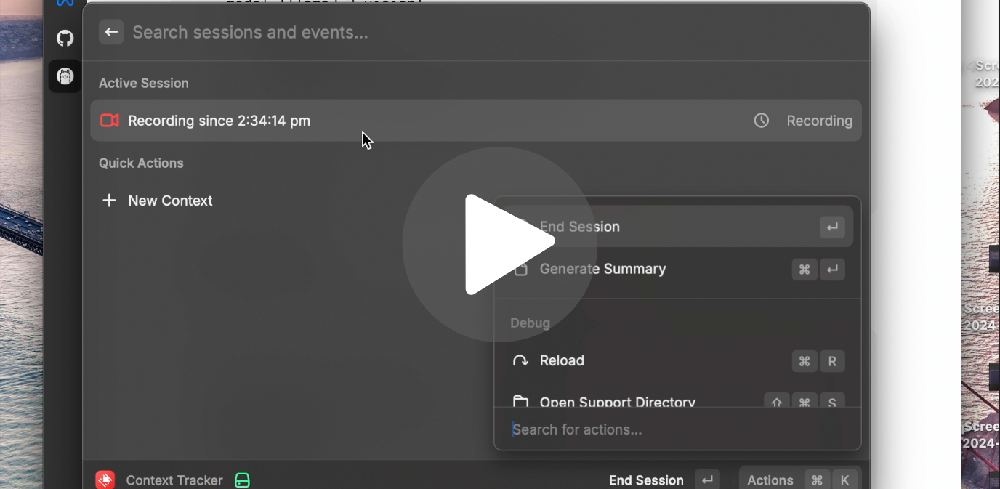

# Context Tracker
[](https://youtu.be/CuOoXqdsD_w?si=nCknNQvhwroWAdGf)

|| [Blog Post](https://open.substack.com/pub/ashwinmirskar/p/context-tracker-ai?r=b1eef&utm_campaign=post&utm_medium=web) || [Demo Video](https://youtu.be/CuOoXqdsD_w?si=nCknNQvhwroWAdGf) ||

This repository contains a context tracking system that captures screen activity, analyzes it using LLM providers, and stores the context data for further analysis. The system is designed to help users track their activities and generate summaries of their sessions. Checkout the Raycast plugin [here](https://github.com/Pythonista7/context-tracker).


## Table of Contents

- [Installation](#installation)
- [Usage](#usage)
- [Configuration](#configuration)

## Installation

1. Clone the repository:
    ```sh
    git clone https://github.com/Pythonista7/context-tracker-backend
    cd context-tracker-backend
    ```

2. Create a virtual environment and activate it:
    ```sh
    python -m venv venv
    source venv/bin/activate  # On Windows use `venv\Scripts\activate`
    ```

3. Install the required dependencies:
    ```sh
    pip install -r requirements.txt
    ```

## Usage

1. Start the server:
    ```sh
    python server.py
    ```

2. Use the provided API endpoints to create contexts, start sessions, capture screen activity, and generate summaries.


## Configuraions
To configure the context tracking system, you need to set up the following environment variables:

#### Environment Variables

- `OPENAI_API_KEY`: Your OpenAI API key for accessing OpenAI's LLM services.
- `ANTHROPIC_API_KEY`: Your Anthropic API key for accessing Anthropic's LLM services.
- `DATABASE_URL`: The URL for your database where context data will be stored.
- `FLASK_ENV`: The environment in which the Flask server is running (`development` or `production`).

#### Modifying constants.py
You may need to modify constants.py to set paths and other constants as needed for your specific setup.

